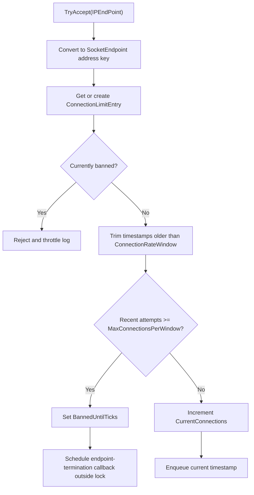

# Connection Quota Options

`ConnectionQuotaOptions` configures per-IP connection limits, concurrency caps, rate window admission checks, and cleanup behavior used by `ConnectionGuard`.

## Source Mapping

- `src/Nalix.Network/Options/ConnectionQuotaOptions.cs`
- `src/Nalix.Network/RateLimiting/Connection.Guard.cs`
- `src/Nalix.Network/RateLimiting/Connection.Guard.Subnet.cs`
- `src/Nalix.Hosting/Bootstrap.cs`

## Defaults and Validation

| Property | Default | Validation | Runtime consumer |
| --- | ---: | --- | --- |
| `ExemptLoopback` | `true` | Boolean | Loopback clients (`127.0.0.0/8`, `::1`, `::ffff:127.x.x.x`) bypass per-IP and per-subnet caps, rate windows, and automatic bans. The global `ConnectionGuardOptions.MaxConnections` cap still applies. |
| `MaxConnectionsPerIpAddress` | `10` | `1..10_000` | `ConnectionGuard` concurrent slot limit per endpoint. |
| `MaxConnectionsPerWindow` | `10` | `1..10_000_000` | `ConnectionGuard` rate-window admission check. |
| `ConnectionRateWindow` | `00:00:05` | `00:00:01..00:10:00` | Sliding window used to trim recent connection timestamps. |
| `MaxConnectionsPerSubnet` | `50` | `1..100_000` | Maximum concurrent connections per /24 (IPv4) or /48 (IPv6) subnet. |
| `MaxSubnetConnectionsPerWindow` | `100` | `1..10_000_000` | Maximum connection attempts from a subnet within the rate window. |
| `CleanupInterval` | `00:01:00` | `00:00:01..01:00:00` | Recurring cleanup interval for stale endpoint entries. |
| `InactivityThreshold` | `00:05:00` | `00:00:01..1.00:00:00` | Age cutoff for removing inactive zero-connection entries. |
| `MaxCleanupKeysPerRun` | `0` | `0..10_000_000` | Max endpoint keys scanned per cleanup cycle; `0` auto-scales based on tracked entry count. |
| `DailyResetTimeOffset` | `00:00:00` | `-14:00:00..14:00:00` | UTC offset used to determine the start-of-day for daily connection-limit resets. |

!!! note "Loopback and local benchmarks"
    With the stock limits (10 concurrent / 10 attempts per 5 s, halved in burst mode) a single
    remote IP that opens more than a handful of connections at once is rejected and then
    progressively banned. Loopback is exempt by default so local development, integration tests,
    and load generators on the same host are not banned. Set `ExemptLoopback = false` if untrusted
    traffic can reach the server through a loopback hop (for example a same-host reverse proxy
    that does not forward the real client address) — in that setup prefer configuring
    `TrustedProxyOptions` so the real client IP is limited instead.

!!! tip "Configure order"
    `ConnectionGuard` is created during `Build()`, after every `Configure<TOptions>()` delegate
    runs, so `Configure<ConnectionQuotaOptions>(...)` may appear before or after
    `UseSecureConnections()` / `UseSystemControl()`.

`Validate()` runs DataAnnotation validation and throws `ValidationException` when constraints are violated.

## Adaptive Proof-of-Work

When adaptive mode is enabled, `ConnectionGuard` dynamically adjusts the PoW difficulty based on the current connection rate. This acts as an anti-DDoS mechanism: under normal load, PoW is trivial or disabled; under high load, difficulty increases to throttle automated connection floods.

| Property | Default | Valid range | Description |
| --- | ---: | --- | --- |
| `EnableAdaptiveMode` | `false` | Boolean | Enables dynamic PoW difficulty scaling. |
| `AdaptivePowMinDifficulty` | `0` | `0..32` | Minimum PoW leading-zero-bits (trivial/off when zero). |
| `AdaptivePowMaxDifficulty` | `24` | `0..32` | Maximum PoW difficulty under full load. |
| `AdaptivePowStartRate` | `10` | `1..1_000_000` | Connection rate (req/s) at which difficulty begins to increase. |
| `AdaptivePowMaxRate` | `100` | `10..10_000_000` | Connection rate (req/s) at which maximum difficulty is reached. |

Difficulty scales linearly between `AdaptivePowMinDifficulty` and `AdaptivePowMaxDifficulty` as the EWMA connection rate moves from `AdaptivePowStartRate` to `AdaptivePowMaxRate`.

When `IsUnderAttack` is `true` (difficulty > min), the handshake handler requires clients to solve a PoW challenge before proceeding. Clients that have not passed PoW are sent a `POW_REQUIRED` control signal and must submit a `POW_PROOF` packet. The server verifies the proof, sets `connection.Level = POW_VERIFIED`, and allows the handshake to continue.

!!! warning "Client solver performance"
    The client-side solver (`ProofOfWorkSolver.SolveChallenge`) is a blocking brute-force search. Higher difficulty values exponentially increase solve time (approximately `2^difficulty` hashes). Keep `AdaptivePowMaxDifficulty` below `20` for consumer clients.

## Hosting Initialization

`Bootstrap.Initialize()` loads `ConnectionQuotaOptions` during server startup so the server configuration template includes every quota knob:

```csharp
_ = ConfigurationManager.Instance.Get<ConnectionQuotaOptions>();
```

Runtime consumers validate the loaded instance before using it. For example, `ConnectionGuard` validates in its constructor.

## Admission Control Flow



`ConnectionGuard.TryAccept(...)` tracks endpoints by IP address using `SocketEndpoint`. The internal overload accepts `SocketEndpoint` directly to avoid `IPAddress`/`IPEndPoint` heap allocation on the hot path. Limits apply per source address (port excluded from the key).

The entry lock protects mutations to the `ConnectionLimitInfo` value snapshot. The recent-attempt queue is a `ConcurrentQueue<DateTime>` and is trimmed against `ConnectionRateWindow` before each admission check.

## Release and Cleanup Behavior

`OnConnectionClosed(...)` decrements the endpoint's current connection count.

A recurring cleanup job is scheduled with:

- `interval = CleanupInterval`
- `NonReentrant = true`
- `BackoffCap = 15s`
- `Jitter = 250ms`
- `ExecutionTimeout = 2s`

Each run scans at most `MaxCleanupKeysPerRun` endpoint keys per cycle; when `MaxCleanupKeysPerRun` is `0` (the default), the scan count is auto-scaled to a percentage of the current tracked entry count. Entries are removed only when they have no active connections and `LastConnectionTime` is older than `now - InactivityThreshold`. Removed entries have their timestamp queues cleared.

## Related APIs

- [Connection Limiter](../../network/connection/connection-limiter.md)
- [Connection Guard Options](./connection-guard-options.md)
- [Trusted Proxy Options](./trusted-proxy-options.md)
- [Network Options](./options.md)
