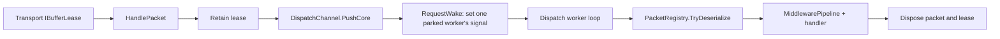

# Packet Dispatch

`PacketDispatchChannel` is the runtime bridge between retained transport buffers and
application packet handlers. It owns the background worker loops, wakes workers when
new packets are queued, deserializes packets through the registered packet registry,
and disposes packet and buffer leases after dispatch completes.

## Source Mapping

- `src/Nalix.Runtime/Dispatching/PacketDispatchChannel.cs`
- `src/Nalix.Runtime/Internal/Routing/DispatchChannel.cs`
- `src/Nalix.Runtime/Dispatching/Options/PacketDispatchOptions.cs`
- `src/Nalix.Runtime/Dispatching/Options/PacketDispatchOptions.PublicMethods.cs`

## Runtime Flow


```mermaid
flowchart LR
    A["Transport IBufferLease"] --> B["HandlePacket"]
    B --> C["Retain lease"]
    C --> D["DispatchChannel.PushCore"]
    D --> E["RequestWake: set one parked worker's signal"]
    E --> F["Dispatch worker loop"]
    F --> G["PacketRegistry.TryDeserialize"]
    G --> H["MiddlewarePipeline + handler"]
    H --> I["Dispose packet and lease"]
```

## `HandlePacket` Handoff Semantics

`HandlePacket(IBufferLease packet, IConnection connection)` is intentionally small:

1. Ignore `null` inputs and empty leases.
2. Call `packet.Retain()` before asynchronous handoff.
3. Enqueue with `_dispatch.PushCore(connection, packet, noBlock: true)`.
4. Dispose the retained lease if enqueue fails.
5. Request a worker wake if enqueue succeeds.

This means the transport may dispose its own reference immediately after calling
`HandlePacket`; the dispatch channel owns a retained reference until execution ends.

## Worker Loop Selection

`Activate()` starts worker loops through `TaskManager.ScheduleWorker`.
The number of loops is resolved as follows:

| Case | Source behavior |
| --- | --- |
| `Options.DispatchLoopCount` is set | Use the explicit value. |
| `Options.DispatchLoopCount` is `null` | Use `Math.Clamp(Environment.ProcessorCount, MinDispatchLoops, MaxDispatchLoops)`. |

The worker name format is `net.dispatch.process.{index}` through `TaskNaming` tags,
and workers are scheduled with `WorkerPriority.HIGH`.

## Wake and Drain Behavior

Each worker owns a reusable, allocation-free auto-reset signal (`WorkerWakeSignal`, backed by
`ManualResetValueTaskSourceCore<bool>`) and a "parked" flag. There is no timer poll.

- A worker that finds no claimable connection marks itself parked (interlocked), re-checks the ready
  queues, and only then awaits its signal. A producer publishes the ready entry (interlocked) before
  `RequestWake()` scans the parked flags, so either the worker sees the work or the producer sees the
  worker parked: a wake cannot be lost.
- `RequestWake()` wakes **one** parked worker per connection that becomes ready, starting at a rotating
  index so wake-ups are spread across workers. A worker that claims a session while more connections
  are still claimable wakes another parked worker, so bursts fan out.
- Signals are sticky and coalesced: a `Set()` before the wait makes the next wait complete synchronously.
- `Deactivate()` sets every worker's signal, and each worker registers its cancellation token once to set
  its own signal, so shutdown and external cancellation are observed without polling.

Worker loops drain up to `_maxDrainPerWake` packets before waiting again. The drain
budget is calculated in the constructor:

```csharp
Math.Clamp(
    Environment.ProcessorCount * Options.MaxDrainPerWakeMultiplier,
    Options.MinDrainPerWake,
    Options.MaxDrainPerWake)
```

Default option values make this clamp resolve within a bounded range derived from
`Environment.ProcessorCount` and the configured drain multipliers in `PacketDispatchOptions`.

## DispatchChannel Queue Behavior

`DispatchChannel<TPacket>` is the internal queue behind `PacketDispatchChannel`.
It maintains per-connection state and priority-ready queues.

| Concern | Source behavior |
| --- | --- |
| Priority classification | Reads the priority byte at `PacketHeaderOffset.Priority`; invalid or short buffers use `PacketPriority.NONE`. |
| Priority selection | Uses weighted round-robin budgets, scanning from `PacketPriority.URGENT` down to `PacketPriority.NONE`. |
| Default priority weights | If `DispatchOptions.PriorityWeights` is absent or short, each missing weight uses `1 << priorityIndex`. |
| Per-connection bounds | Enabled when `DispatchOptions.MaxPerConnectionQueue > 0`. |
| Overflow handling | Uses `DropPolicy.DropNewest`, `DropOldest`, `Coalesce`, or `Block`; packet dispatch calls `PushCore(..., noBlock: true)`, so block-mode enqueue fails fast from `HandlePacket`. |
| Cleanup | `src/Nalix.Runtime/Internal/Routing/DispatchChannel.cs` subscribes to `IConnectionHub.ConnectionUnregistered` and drains/disposes queued leases for removed connections. |

## Execution and Disposal Guarantees

When a worker pulls a lease:

1. If the handler expects `ReadOnlyMemory<byte>`, a `MemoryPacket` is created directly from the lease, bypassing the registry.
2. Otherwise, `PacketRegistry.TryDeserialize(lease.Span, out IPacket?)` is called.
3. Deserialization failure increments the connection error count and disposes the lease.
4. Successful packets are executed through `ExecutePacketHandlerAsync`.
5. Synchronous completions dispose `IDisposable` packets and the lease immediately.
6. Asynchronous completions are awaited by a helper that disposes both in `finally`.
7. Non-fatal handler exceptions increment the connection error count and are logged.

## Diagnostics

`GenerateReport()` and `WriteReportData(Utf8JsonWriter writer)` expose the current runtime snapshot:

| Field | Meaning |
| --- | --- |
| `Running` | Whether workers are currently active. |
| `DispatchLoops` | Number of scheduled dispatch worker loops. |
| `WakeSignals` | Number of calls that released wake signals. |
| `WakeReads` | Number of times a parked worker resumed from its wake signal. |
| `IdleWorkers` | Workers currently parked or about to park. |
| `TotalPackets` | Total queued packets in `DispatchChannel`. |
| `TotalConnections` | Active tracked connection states. |
| `ReadyConnections` | Connections currently marked ready. |
| `PendingPerPriority` | Ready-entry snapshot per priority level. |
| `PendingByConnection` | Top pending connections in `WriteReportData()`. |

## Related APIs

- [Dispatch Contracts](./dispatch-contracts.md)
- [Packet Dispatch Options](../../options/runtime/packet-dispatch-options.md)
- [Dispatch Channel and Router](./dispatch-channel-and-router.md)
- [Middleware Pipeline](../../../concepts/internals/middleware-pipeline.md)
