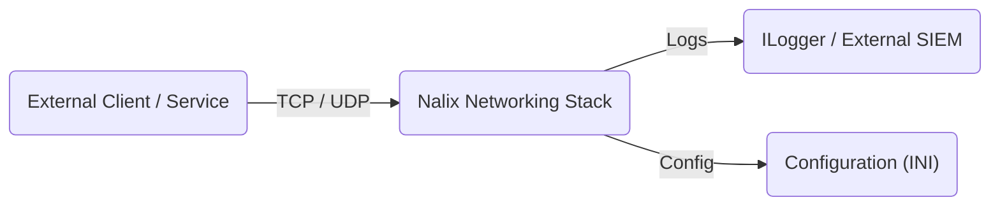
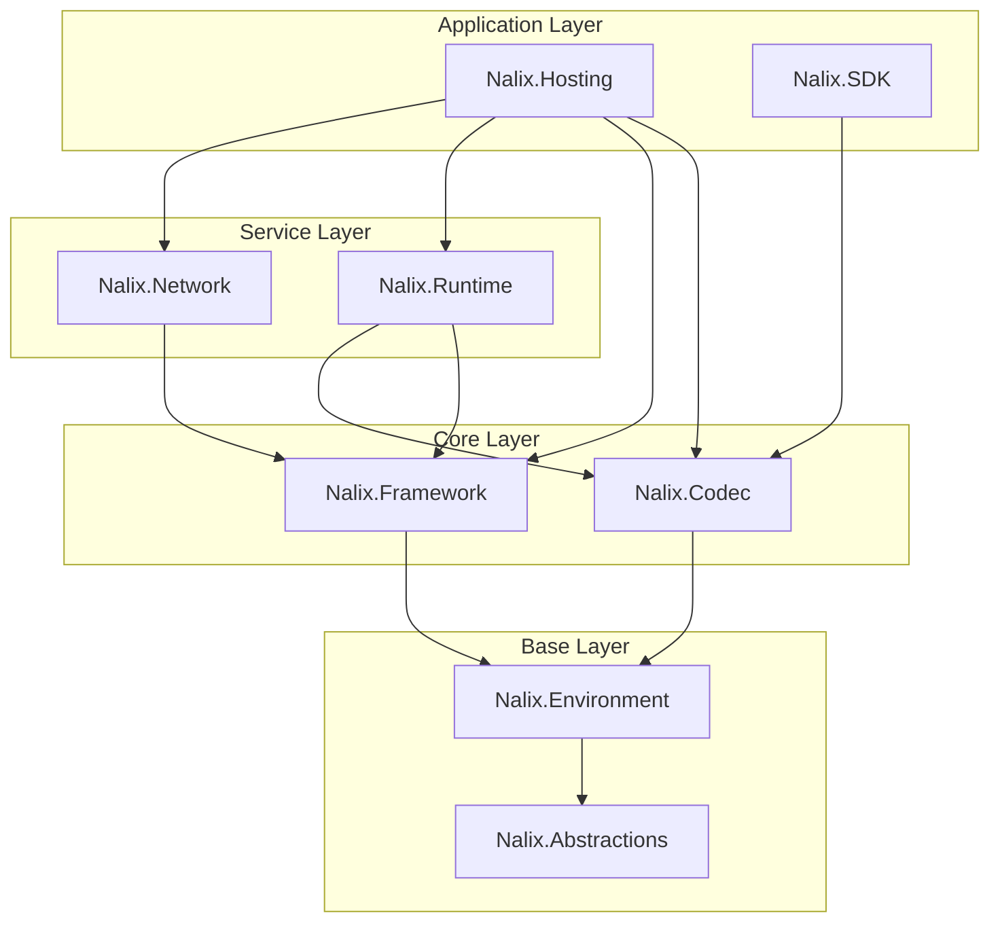
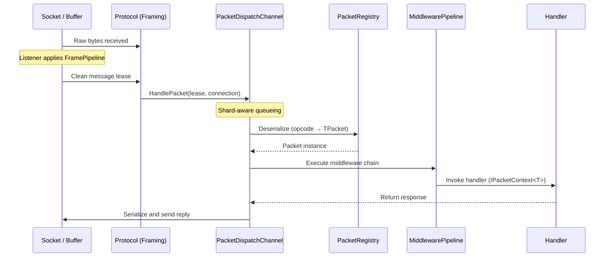

# System Architecture

The Nalix architecture is designed for high-throughput, low-latency networking with a focus on zero-allocation data paths and shard-aware execution. This page explains how the framework's packages relate to each other, how data flows through the system, and where each component sits in the overall design.

## System Context

At the highest level, Nalix is a networking stack that sits between external clients and your application logic.

## Package Dependency Map

Nalix uses a modular package architecture. Each package has a focused responsibility and a well-defined dependency direction.

| Layer | Package | Responsibility |
| :--- | :--- | :--- |
| Hosting | `Nalix.Hosting` | Fluent builder, application lifecycle, automatic discovery |
| Transport | `Nalix.Network` | TCP/UDP listeners, connection lifecycle, protocol bridge, session store |
| Dispatch | `Nalix.Runtime` | Packet dispatch, middleware, handler compilation |
| Pipeline | `Nalix.Runtime` | Rate limiting, concurrency gating, middleware, dispatch execution |
| Infrastructure | `Nalix.Framework` | DI, task scheduling, object pooling, identifiers |
| Codec | `Nalix.Codec` | Serialization, packet registry, framing, compression, cryptography |
| Environment | `Nalix.Environment` | Configuration, directories, random generation, clock/time helpers |
| Contracts | `Nalix.Abstractions` | Shared abstractions, packet attributes, connection contracts |
| Client | `Nalix.SDK` | Transport sessions, request/response correlation, handshake and resume flows |

## Server vs. Client Separation

Nalix enforces a clear separation of concerns between the server host and the client SDK.

**Server (thick host):** The host owns socket listeners, connection management, the connection hub, and the shard-aware dispatch channel. It is responsible for scale (worker sharding), security (admission control, rate limiting), and application orchestration (middleware, handler compilation).

**Client (thin SDK):** The SDK focuses on session management, automated request/response correlation, and transparent encryption/compression. The client does not embed dispatch or middleware infrastructure — it sends and receives packets directly.

**Shared contracts:** Packet definitions (POCOs annotated with `[SerializePackable]`) should live in a shared assembly referenced by both server and client projects.

## The Packet Journey

Understanding how a packet moves through the system is the key to effective debugging and optimization.

## Core Building Blocks

### 1. Transport and Listeners

- **`TcpListenerBase`** — High-concurrency TCP listener using `SocketAsyncEventArgs`. Handles socket acceptance, admission control, and the receive start sequence through `Protocol.OnAccept(...)`.
- **`UdpListenerBase`** — Stateless datagram listener with built-in authenticated session mapping and lock-free rate limiting.
- **Connection guard** — Early-stage admission control to reject endpoints at the socket level before allocating any application resources.

### 2. Protocol (The Bridge)

The `IProtocol` interface bridges listener-owned transport state and dispatch. In the common case, `ProcessMessage(...)` receives an already-transformed lease and forwards it to `PacketDispatchChannel`.

### 3. Shard-Aware Dispatch

`PacketDispatchChannel` is the engine of Nalix. It provides:

- **Worker sharding** — Multiple worker loops (parallel to CPU core count) prevent head-of-line blocking. One slow handler does not stall unrelated packets.
- **Wake-signaling** — Each dispatch worker parks on its own allocation-free, reusable wake signal; a producer wakes exactly one parked worker per newly ready connection, with no timer polling.
- **Prioritization** — Native support for `PacketPriority` (`URGENT`, `HIGH`, `MEDIUM`, `LOW`, `NONE`).

### 4. Packet Registry

`PacketRegistry` is the process-wide packet catalog. It is populated automatically by a **Source Generator** that detects packet types during compilation. At runtime, calling `PacketRegistry.Build()` freezes the catalog, providing ultra-fast lookup and deserialization for all registered packet types and built-in signal packets.

### 5. Instance Management

Nalix uses `InstanceManager` (a service-locator pattern optimized for allocation-free resolution) instead of standard DI containers. This ensures that shared services — loggers, packet registries, application services — can be resolved during hot-path execution without container overhead or allocation.

## Protection and Pressure Control

The network runtime is designed to run with pressure controls enabled by default:

| Component | Purpose |
| :--- | :--- |
| `ConnectionGuard` | Socket-level admission control; rejects endpoints before application resources are allocated |
| `TokenBucketLimiter` | Protects against request spikes with configurable burst and refill rates |
| `PolicyRateLimiter` | Per-opcode and per-endpoint rate limiting driven by handler metadata |
| `TimingWheel` | Manages idle timeouts with O(1) scheduling complexity |

## Where Does My Code Go?

| Your code | Which package / layer |
| :--- | :--- |
| Packet definitions (POCOs) | Shared contracts assembly → `Nalix.Abstractions` + `Nalix.Framework` |
| Handler classes | Server project → registered with `PacketDispatchChannel` |
| Middleware | Server project → implements `IPacketMiddleware<TPacket>` from `Nalix.Abstractions` |
| Protocol customization | Server project → extends `Protocol` from `Nalix.Network` |
| Client session logic | Client project → uses `TcpSession` from `Nalix.SDK` |
| Configuration | INI file → loaded by `ConfigurationManager` from `Nalix.Environment` |

## See it in action

- [Quickstart](../../quickstart.md) — Build a complete server and client in minutes.
- [Server Blueprint](../../guides/getting-started/server-blueprint.md) — Learn the recommended project structure for production.
- [Production Checklist](../../guides/deployment/production-checklist.md) — See how architecture layers map to a real deployment.
