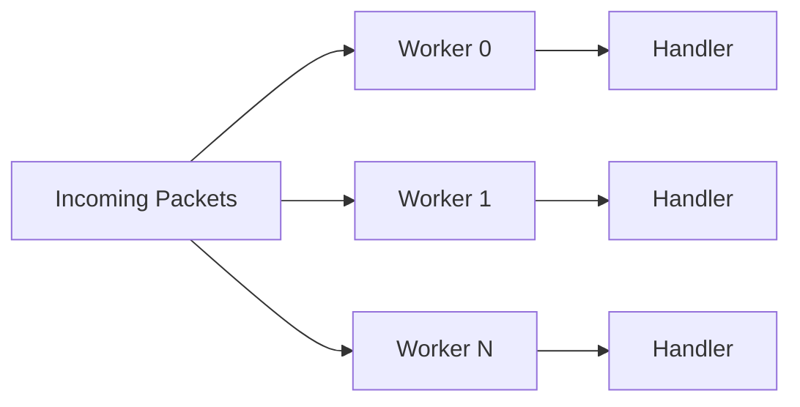

# Performance Optimizations

!!! warning "Advanced Topic"
    This page describes internal framework mechanics like Span limits, structure alignments, and GC overheads.

Nalix is engineered to minimize latency and maximize throughput on the networking hot path. This page explains the specific techniques used and why they matter for production workloads.

## 1. Zero-Allocation Data Path

Traditional networking stacks suffer from GC pressure due to frequent buffer allocations. Nalix eliminates this by pooling all hot-path resources.

!!! tip
    Monitor GC pause time and allocated bytes as your primary performance indicators during load testing.

For a complete end-to-end walkthrough of how these optimizations work together in a production scenario, see the [Zero-Allocation Design](./zero-allocation.md) guide.

### Buffer Pooling (Slab-Based)

Instead of allocating `byte[]` per request, Nalix uses a slab-oriented `BufferPoolManager` backed by standalone pinned arrays managed through internal slab buckets. `BufferLease` then exposes owned slices over those rented arrays. This keeps hot-path rentals predictable while avoiding per-request heap churn.

- **Pinned pooled arrays** — Internal buckets keep reusable pinned arrays alive on the **Pinned Object Heap (POH)** so hot paths can rent already-prepared buffers instead of allocating new ones.
- **Lock-free allocation** — Minimizes thread contention during high-frequency leasing using thread-local caches.
- **Atomic Lease Tracking** — `BufferLease` instances are pooled using a lock-free free-list with an **O(1) atomic counter**, avoiding the linear-time overhead of traditional collection count checks.
- **Span-first API** — Leverages `Span<byte>` and `ReadOnlySpan<byte>` for slicing without copying data.
- **Deterministic lifetime** — `BufferLease` implements `IDisposable`, ensuring buffers return to the pool after handler execution.

### Poolable Contexts & Objects (Thread-Local & Type-Indexed)

The concrete `PacketContext<TPacket>` runtime object and internal hot-path objects are recycled via the `ObjectPoolManager` / `ObjectPool` framework. To completely eliminate locks and dictionary lookup overhead on the hot path:

- **Thread-Local Fast Path**: A thread-local slot cache (`ThreadLocalCache<T>`) retains one instance of each type per thread, allowing lock-free $O(1)$ rent/return operations.
- **Type-Indexed Buckets**: Unique, sequentially allocated integer identifiers (`PoolType<T>.Id`) index a flat lookup array (`_typePoolsArray`), bypassing costly reflection or `Type` dictionary hashing.
- **88% Latency Reduction**: This hybrid design reduces object pooling overhead from **188 ns** down to **22.8 ns** while maintaining **0 B** heap allocations. Handler code should normally consume contexts through the `IPacketContext<TPacket>` interface.

## 2. Managed Async Dispatching

Nalix schedules its dispatch loops via `TaskManager.ScheduleWorker()` on the .NET ThreadPool. This avoids the overhead of manual thread ownership while still letting the runtime scale worker count and drain budgets for the current workload.

```mermaid
graph LR
    Incoming["Incoming Packets"] --> Shard0["Worker 0"]
    Incoming --> Shard1["Worker 1"]
    Incoming --> ShardN["Worker N"]
    Shard0 --> Handler0["Handler"]
    Shard1 --> Handler1["Handler"]
    ShardN --> HandlerN["Handler"]
```

- **Managed Drain Budget** — A "drain budget" ensures that each wake cycle processes a batch of packets before yielding, balancing latency and throughput.
- **Parallel execution** — Workers are scaled to match logical CPU cores in auto mode.
- **Coalesced wake** — Per-worker `IValueTaskSource` wake signals (no allocation, no timer) wake one parked worker per newly ready connection, avoiding unnecessary thread pool pressure.

## 3. 64-bit Snowflake Identifiers

Nalix uses a customized 64-bit Snowflake identifier for internal task tracking and packet correlation.

| Design choice | Rationale |
| :--- | :--- |
| 64-bit (vs. standard 64-bit) | Fits efficiently into packed headers, avoids 53-bit precision limits in JavaScript-based clients |
| 1 ms timestamp resolution | Sufficient for networking use cases; enables 4,096 IDs per millisecond per shard (12-bit sequence) |
| Deterministic ordering | Snowflake IDs are sortable by creation time, enabling natural ordering in logs and diagnostics |

## 4. OpCode-Based Registry Lookups

The `PacketRegistry` uses a `PacketDeserializer?[]` table indexed by `ushort` OpCode for packet type resolution.

- **O(1) access** — A fixed 65536-entry table is built once at startup. Each packet's `ushort` OpCode directly indexes into the array.
- **No dictionary overhead** — Table lookup is a single array index operation with no hashing, no probing, and no dictionary indirection.
- **Static OpCodes** — Packet types are identified by a `ushort` value defined at compile time via the `IPacketStaticOpcode` interface, eliminating runtime hash computation.

## 5. Metadata Pre-Compilation

Middleware and handler metadata are not resolved via reflection on every request.

- **Compiled handlers** — Handler methods are wrapped in pre-compiled delegates during `Build()`. No reflection occurs during handler invocation.
- **Attribute caching** — Packet metadata (permissions, timeouts, rate limits, concurrency limits) is resolved once during handler registration and cached alongside the packet entry in the registry.

## 6. LZ4 Compression

The `LZ4Codec` provides pooled block compression and decompression optimized for networking payloads.

- **Pooled hash tables** — `LZ4HashTablePool` manages reusable hash tables to avoid allocation during compression.
- **Span-based API** — Both `Encode` and `Decode` accept `ReadOnlySpan<byte>` input and `Span<byte>` output, supporting zero-copy integration with the buffer pool.
- **Lease-based output** — `Encode(input, out BufferLease lease, out int bytesWritten)` produces a pooled buffer lease ready for direct network transmission.

## Maintaining Performance in Your Application

To preserve these performance characteristics in your own handlers and middleware:

1. **Always dispose `BufferLease` and `PacketScope<T>`** — Leaking pooled resources degrades throughput over time.
2. **Avoid blocking in handlers** — Use `async`/`await` for I/O. For scheduled work, use `TaskManager` or `TimingWheel` instead of `Task.Delay`.
3. **Prefer `ValueTask` for handler return types** — Avoids unnecessary `Task` allocations on synchronous (already-complete) code paths.
4. **Use `IPacketContext.Packet`** — Access the deserialized packet from the context rather than creating new instances.

## Benchmarks

For measured performance data across serialization, cryptography, compression, and infrastructure, see the [Benchmarks](../../benchmarks/index.md) section.

## Recommended Next Pages

- [Architecture](./architecture.md) — Layered component overview
- [Packet System](../how-packets-work.md) — Serialization layouts and wire format
- [Buffer Management](../../api/environment/memory/buffer-management.md) — Buffer pool API details
- [Object Pooling](../../api/framework/memory/object-pooling.md) — Object recycling API details
- [LZ4](../../api/codec/lz4.md) — Compression API details
